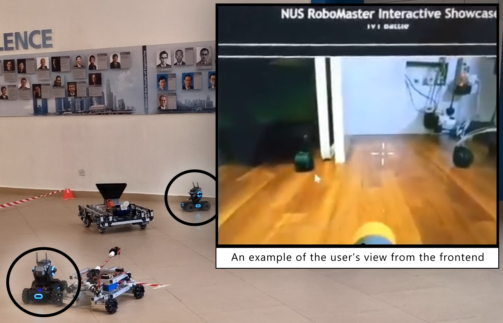

# Client Frontend for Controlling Robots Remotely using webRTC

## Overview of Project
This repository is part of the **Online Robot Remote Control** project where users can log in to a website to remotely control one of any number of robots in a fleet from the comfort of their homes using WebRTC. 

    

This particular repository houses the frontend for this project, which a user can use to login with a nickname and enter the queue to try and pair with an available robot. This initiates a WebRTC offer from the frontend which is sent to the Signalling Server. If no answer is returned by an available robot through the Signalling Server, the user is instead placed into a queue to wait for a robot to become available.

#### Other Repositories
- [Signalling Server](https://github.com/nusrobomaster/NUS_RoboMaster_Signalling_Server)
- [Robot Control](https://github.com/nusrobomaster/RoboMaster_S1_Web_Remote)

## Installation
- Clone this repository
- Install node.js
- In this repository, run `npm install` to get required dependencies
- Run `npm run start` to run the frontend on your local machine.
    - Note that this runs the app in debug mode, not release.